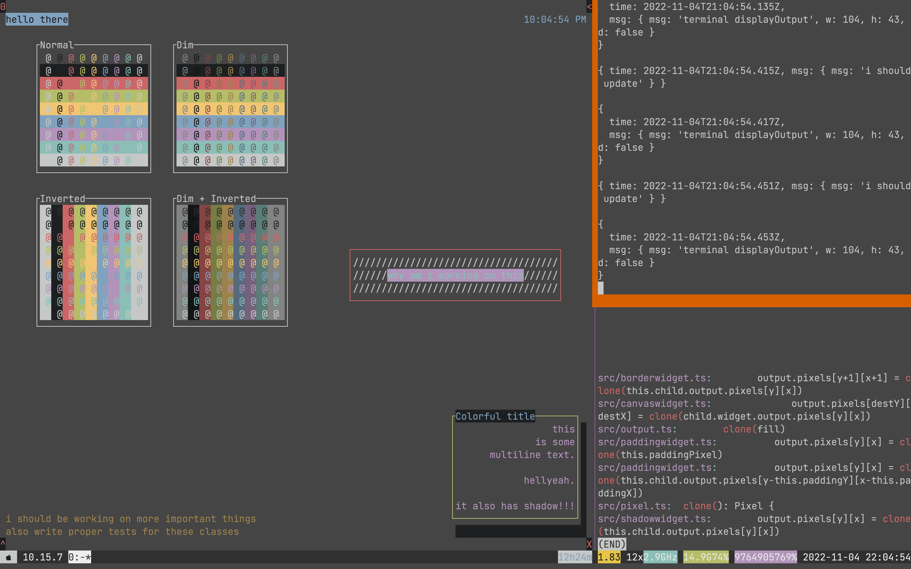

# k8nspect

endgoal: k9s alternative with slightly different (and smaller) feature-set, but hopefully less lag

* very WIP
* currently working on some terminal user interface library
  * project derailed of course
  * i quickly realized that displaying some proper terminal UI is not that simple
  * didnt want to use heavy-weight dependencies (blessed, terminal-kit, ink), just wanted something "lightweight"
  * that lightweight solution turned into something very complex very quickly

---

